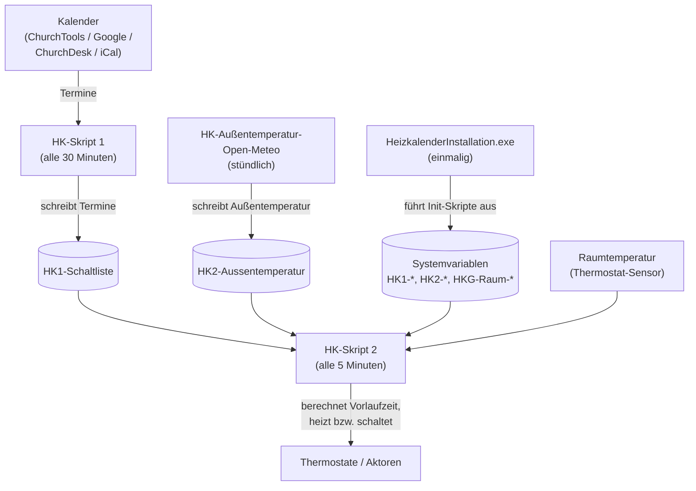
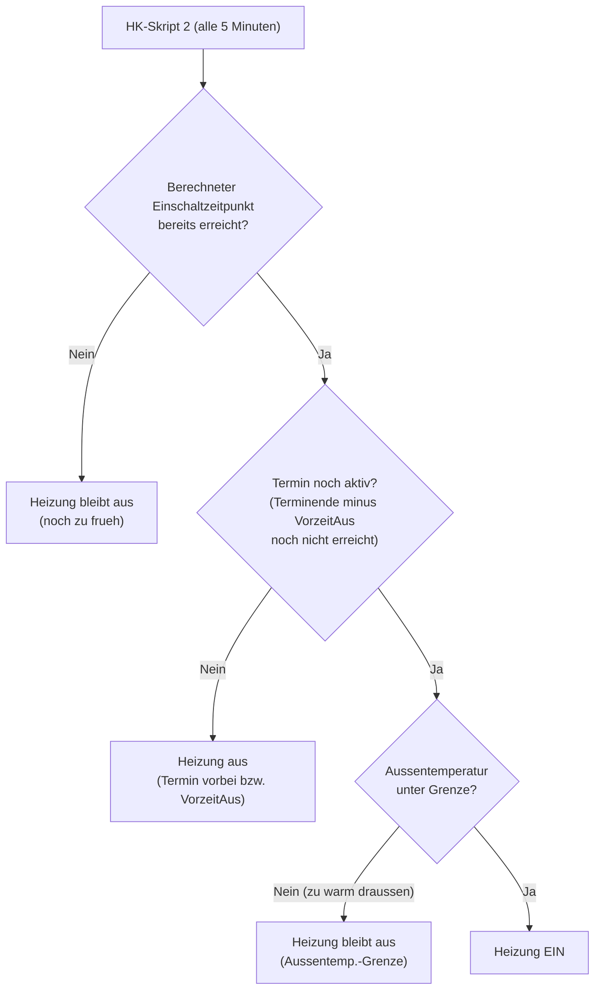

# Anwenderhandbuch

Der Heizkalender ist für Gebäude mit sporadisch oder unregelmäßig genutzten Räumen
gedacht: kommunale und kirchliche Gemeindegebäude, Vereinsheime, unregelmäßig genutzte
Büroräume, kleine Hotels, Freizeitheime, Jugendherbergen, Ferienwohnungen. Über den
Belegungsplan im Kalender wird die Heizung termingenau und witterungsabhängig nur für
den benötigten Raum eingeschaltet.

Dieses Handbuch richtet sich an Administratoren, die den Heizkalender betreiben und
konfigurieren. Es erklärt die wiederkehrenden Aufgaben im laufenden Betrieb: Räume
benennen, das Heizverhalten über die Vorheizzeit einstellen und einzelne Termine mit
Sonderbefehlen steuern.

Für die Erstinstallation siehe die
[Installer-Anleitung](../HeizkalenderInstallation/Dokumentation/Readme.md). Davor
helfen die [Planung](Planung.md) (Struktur und Nomenklatur) und das Beschaffen der
[Kalender-Zugangsdaten](Kalender-einrichten.md).
Die vollständige Liste aller Systemvariablen steht in der
[Skript-Referenz](../Skripte/Dokumentation/Readme.md).
Einen allgemeinen Überblick über das Projekt und weitere Varianten bietet die
Projekt-Homepage <https://heizkalender.de/>.

## Wie der Heizkalender funktioniert

Der Heizkalender hält Räume grundsätzlich auf einer niedrigen Grundtemperatur und
schaltet nur dann auf Wohlfühltemperatur, wenn im Kalender ein Termin eingetragen ist.
Dadurch lassen sich 15 bis 25 Prozent Heizenergie sparen, ohne dass jemand vor Ort
die Heizung manuell bedienen muss.

Aus Praxis-Messungen ergibt sich ein konkretes Einsparpotential: Bei einem Gebäude,
das 1,5 von 7 Tagen auf voller Wohlfühltemperatur (21 °C) beheizt wird und sonst auf
Grundtemperatur (16,5 °C) läuft, ergibt sich rund 25 Prozent weniger Energieverbrauch
gegenüber Dauerbetrieb.

Der Ablauf im Überblick:



Ablauf im Detail:

1. **Einmalig:** Der Installer schreibt über die Init-Skripte die Systemvariablen.
2. **Stündlich:** `HK-Außentemperatur-Open-Meteo` aktualisiert die Außentemperatur in `HK2-Aussentemperatur`.
3. **Alle 30 Minuten:** Skript 1 liest den Kalender und schreibt die anstehenden Termine in `HK1-Schaltliste`.
4. **Alle 5 Minuten:** Skript 2 berechnet aus der Schaltliste, der Außentemperatur und der aktuellen Raumtemperatur die Vorlaufzeiten und heizt bzw. schaltet die Räume entsprechend.

## Voraussetzungen

### Kalender

Die Gebäudenutzung (Raumbelegung) muss möglichst konsequent über ein Kalendertool
gepflegt werden. Der Heizkalender unterstützt zwei technische Zugangsarten:

- **Application Programming Interface (API):** Programmierspezifischer Zugang, bietet
  mehr Möglichkeiten und ist die bevorzugte Variante (ChurchTools, Google).
- **Internet Calendar Scheduling (ICS/iCal):** Allgemeiner Kalenderstandard, universell
  verwendbar, aber im Funktionsumfang eingeschränkter (ChurchDesk, beliebige iCal-URLs).

Unterstützte Kalenderquellen:

- ChurchTools (via API)
- Google-Kalender (via API)
- ChurchDesk (mit spezieller ICS-Version)
- Sonstige ICS/iCal-kompatible Kalender (mit allgemeiner ICS-Version)

### Homematic-Hardware

Alle Heizkörper der zu steuernden Räume müssen mit Homematic-Thermostaten ausgestattet
sein. Der Heizkalender unterstützt sowohl die Klassik-Serie (auslaufend) als auch die
IP-Serie (aktuell, empfohlen). Innerhalb einer zu schaltenden Gruppe müssen alle Geräte
derselben Serie angehören. Die Thermostatventile kosten ab ca. 25 Euro pro Stück.

Nebenräume (Flure, WCs), die dauerhaft auf Grundtemperatur bleiben sollen, benötigen
keinen steuerbaren Thermostat. Eine Grundtemperatur von 16 °C entspricht dem
Skalenwert 2 (Schneeflocken-Symbol) an üblichen Thermostatventilen.

### Central Control Unit (CCU)

Für die Installation der Heizkalender-Skripte und die Steuerung der Ventile wird
eine kompatible Smart-Home-Zentrale benötigt, die Internetverbindung für den
Kalender-Abruf hat. Empfohlen wird [OpenCCU](https://github.com/jens-maus/RaspberryMatic)
(bis Ende 2025 als „RaspberryMatic" bekannt): ein freies, OpenSource-Betriebssystem
für Homematic-CCU-Zentralen. Die Hersteller-Software der CCU3 von eQ-3 ist
abgekündigt; eQ-3 übergibt die Weiterentwicklung schrittweise an die Community
(bis Ende 2026 werden noch neue Homematic-IP-Produkte integriert, ab 2027 übernimmt
die Community). Hintergründe dazu sind auf der
[eQ-3-Informationsseite](https://homematic-ip.com/de/news/ccu3-smart-home-naechstes-kapitel)
nachzulesen. Es läuft auf eQ3-CCU3, ELV-Charly, RaspberryPi,
Tinkerboard, ODROID und zahlreichen weiteren Plattformen einschließlich
virtueller Maschinen (Proxmox, Docker, Home Assistant u.a.).

Kosten: ca. 80 Euro (Raspberry Pi mit einfachem Funkmodul) bis ca. 180 Euro
(CCU2 der Firma ELV mit erweiterten Smart-Home-Funktionen).

### Apps (optional)

Der Heizkalender kann vollständig ohne Apps eingerichtet und betrieben werden. Als
ergänzende Bedienoberfläche für die CCU sind folgende Apps geeignet:

- **Mediola:** vielfältig, Grundrisse möglich, aber aufwändig
- **@Home:** gut bei Grafiken, kostenlos mit Werbung
- **pocket control HM** (nur iPhone): gut im Verwalten, sehr geringe Kosten
- **TinyMatic** (nur Android): zum Erstellen von Systemvariablen kostenlos nutzbar

## Namenskonvention

Innerhalb der CCU dürfen **keine Namen doppelt auftreten**. Das gilt für Kanäle,
Geräte, Räume und Systemvariablen gleichermaßen. Doppelte Namen führen dazu, dass
die Skripte das falsche oder gar kein Objekt ansprechen.

Besondere Sorgfalt braucht die Raumbezeichnung im Kalender:

- **ChurchTools und ChurchDesk:** Der Administrator legt „Ressourcen" an, aus denen
  der Benutzer beim Eintragen eines Termins auswählt. Dadurch ist die Bezeichnung
  automatisch eindeutig. Wird keine Ressource ausgewählt, wird der Raum nicht beheizt.
- **Google-Kalender und ICS/iCal:** Hier muss der Raum mit einer eindeutigen, stets
  gleichen Bezeichnung (mit vorangestelltem `#`) im Termintitel eingetragen werden.
  Wählen Sie schon bei der Installation unverwechselbare Bezeichnungen und verwenden
  Sie bei jedem Termin genau diese fehlerfrei. Umgekehrt darf die Bezeichnung nicht
  auftauchen, wenn der Raum nicht gemeint ist.

## Räume benennen (Raumvariablen)

Jeder Raum wird über eine Systemvariable mit dem Namensschema
`HKG-Raum-<Name>` abgebildet, zum Beispiel `HKG-Raum-GrSaal` oder
`HKG-Raum-Foyer`. Diese Variablen werden normalerweise bei der Installation
automatisch angelegt.

Der Wert einer Raumvariablen ist eine semikolongetrennte Liste mit folgenden
Feldern:

```txt
Status;Modus;Heiztyp;Wohlfühltemp[/Grundtemp];Vorheizzeit[*Faktor];VorzeitAus[;Heizgruppe:Name:N]
```

| Feld | Bedeutung |
| :--- | :--- |
| Status | `0` = keine Heizphase, `1` = Raum ist in einer Heizphase |
| Modus | `H` = Heizen, `S` = Schalten, `HS` = Heizen und Schalten kombiniert |
| Heiztyp | Gerätetyp-Kennung des Aktors: `IP` (Homematic IP Thermostat), `RT`, `TC`, `IT` (Klassik-Thermostate), `SW` (Schalt-Aktor) |
| Wohlfühltemp | Zieltemperatur während des Termins, optional mit `/Grundtemp` für eine abweichende Grundtemperatur |
| Vorheizzeit | Individuelle Vorheizzeit in Minuten, optional mit `*Faktor` (siehe unten) |
| VorzeitAus | Minuten, um die vor Terminende abgeschaltet wird |
| Heizgruppe | Optional: `Heizgruppe:Name:N` zur Zuordnung mehrerer Aktoren |

Beispielwert: `0;H;IP;18;0;30` bedeutet: kein aktives Heizen, Modus Heizen,
Homematic-IP-Thermostat, Wohlfühltemperatur 18 °C, keine zusätzliche individuelle
Vorheizzeit, 30 Minuten vor Terminende abschalten.

### Mehrere Räume gemeinsam schalten

In der Variablen `HK2-HKG-Liste` lassen sich mehrere Räume mit einem `+`-Zeichen
zu einer gemeinsam geschalteten Einheit zusammenfassen; verschiedene
Einheiten werden mit `;` getrennt. Jeder Raum behält dabei seine eigene
Raumvariable mit eigener Vorheizzeit und Wohlfühltemperatur.

Beispiel: `HKG-Raum-GrSaal+HKG-Raum-Foyer+HKG-Raum-WCs;HKG-Raum-KlSaal`
fasst Großen Saal, Foyer und WCs zusammen; der Kleine Saal bildet eine eigene
Einheit.

## Vorheizzeit

Die Vorheizzeit bestimmt, wie lange vor Terminbeginn ein Raum von der
Grundtemperatur auf die Wohlfühltemperatur gebracht wird. Sie setzt sich aus zwei
Anteilen zusammen:

1. der **individuell** in der Raumvariablen definierten Vorheizzeit und
2. der **automatisch aus der Außentemperatur** errechneten Vorheizzeit
   (über die Heizkurve `HK2-Kurve`).

Ist ein Raum zu Beginn bereits wärmer als die Grundtemperatur (z.B. durch einen
vorhergehenden Termin, Nachbarräume oder Sonneneinstrahlung), verkürzt
HK-Skript 2 die Vorheizzeit automatisch. Hat der Raum die Zieltemperatur schon
erreicht, entfällt die Vorheizzeit ganz. Die Neuberechnung erfolgt alle 5 Minuten.

### Wann heizt ein Raum? (Entscheidungsablauf)

HK-Skript 2 prüft alle 5 Minuten für jeden Raum drei Bedingungen. Nur wenn alle
drei erfüllt sind, wird geheizt. Das erklärt die häufige Frage „Warum heizt mein
Raum (nicht)?".



Der Einschaltzeitpunkt selbst ergibt sich aus der Vorheizzeit (siehe oben): je
kälter es draußen und je kühler der Raum, desto früher wird eingeschaltet.

> [!NOTE]
> Als Außentemperatur verwendet der Heizkalender **nicht** den aktuellen Momentanwert,
> sondern einen gleitenden Mittelwert über 36 Stunden. Das Skript
> `HK-Außentemperatur-Open-Meteo` berechnet diesen Wert aus den Geodaten der CCU und
> schreibt ihn nach `HK2-Aussentemperatur`. Dadurch wirkt sich die Trägheit des
> Gebäudes realistischer aus, als es ein kurzfristiger Temperatursprung tun würde.
> Alternativ kann die Variable auch von einem eigenen Außentemperatursensor gesetzt
> werden.

Über den optionalen `*Faktor` hinter der Vorheizzeit lässt sich die aus der
Außentemperatur errechnete Verschiebung skalieren (erlaubt zwischen 0.20 und 5.0;
ohne oder bei ungültigem Wert gilt Faktor 1.0). Ein Faktor > 1 heizt bei kalter
Außentemperatur steiler vor, z.B. für träge Fußbodenheizungen.

### Rückstellung am Terminende (manuelle Eingriffe)

Zum Ende der Heizphase stellt HK-Skript 2 den Thermostat wieder auf die
Grundtemperatur (`HK2-Grundtemperatur`) zurück. Zwei Systemvariablen steuern, ob eine
zwischendurch von Hand am Thermostat eingestellte Temperatur dabei Vorrang hat:

| Variable | Wirkung bei `true` |
| :--- | :--- |
| `HK2-Hand-Temp` | Wurde während der Heizphase die Temperatur manuell am Thermostat verändert, bleibt dieser Handwert beim Ausschalten erhalten, statt überschrieben zu werden. |
| `HK2-Hand-Grundtemp` | Entscheidet, ob am Ende der Heizphase die manuell gesetzte Temperatur die Grundtemperatur-Rückstellung ersetzt. |

Mit diesen Optionen lässt sich verhindern, dass der Heizkalender einen bewussten
Eingriff vor Ort sofort wieder zurücksetzt. Stehen beide auf `false` (Default),
setzt der Heizkalender immer auf die konfigurierte Grundtemperatur zurück.

### Die Heizkurve `HK2-Kurve`

Die Heizkurve legt für acht Außentemperatur-Stützpunkte die volle Vorheizzeit
(in Minuten) fest; zwischen den Stützpunkten interpoliert HK-Skript 2 linear.
Der ausgelieferte Default ist:

| Außentemperatur | −10 °C | −5 °C | 0 °C | 8 °C | 10 °C | 12 °C | 15 °C | 17,5 °C |
| :--- | ---: | ---: | ---: | ---: | ---: | ---: | ---: | ---: |
| Vorheizzeit (min) | 162 | 130 | 100 | 59 | 50 | 41 | 30 | 20 |

Diese Werte sollten bei der Installation an das eigene Gebäude angepasst werden.
Eine ausführliche Erklärung der Berechnung mit Beispielrechnungen findet sich in
[Heizsteuerung-Vorheizzeit.md](../Skripte/Dokumentation/Heizsteuerung-Vorheizzeit.md).

Als Orientierungshilfe sind drei Beispielkurven bekannt:

| Kurventyp | −10 °C | −5 °C | 0 °C | 8 °C | 10 °C | 12 °C | 15 °C | 17,5 °C | Einsatz |
| :--- | ---: | ---: | ---: | ---: | ---: | ---: | ---: | ---: | :--- |
| Konservativ (Default) | 162 | 130 | 100 | 59 | 50 | 41 | 30 | 20 | Gut gedämmte Gebäude |
| Mittel | 220 | 180 | 144 | 95 | 85 | 75 | 61 | 50 | Typische Gemeindegebäude |
| Großzügig | 451 | 370 | 297 | 196 | 174 | 154 | 125 | 103 | Träge Heizsysteme / Fußbodenheizung |

Der `*Faktor` in der Raumvariablen skaliert die Kurvenzeit für einzelne Räume
zusätzlich (z.B. `*3.5` für eine Fußbodenheizung mit festem Offset von 240 min).

### Die richtige Grundtemperatur: Heizversuch

Die Grundtemperatur sollte so gewählt werden, dass die Wände nicht zu stark
auskühlen (sonst wird das Wiederaufheizen lang und teuer), aber auch nicht unnötig
hoch. Der passende Wert lässt sich näherungsweise durch einen Heizversuch ermitteln:

1. Dazu sollte es draußen kalt sein, idealerweise nahe der mittleren
   Außentemperatur der Heizperiode. Man braucht eine Möglichkeit, die Raumtemperatur
   in Schritten von höchstens 15 Minuten aufzuzeichnen (z.B. über ein Wandthermostat)
   und grafisch darzustellen.
2. Die Thermostate auf Frostschutz stellen und den Raum über mehrere Tage auskühlen
   lassen (z.B. von Sonntag nach dem Gottesdienst bis zum folgenden Samstag), dabei
   den Temperaturverlauf aufzeichnen.
3. Rechtzeitig vor der nächsten Nutzung auf die Wohlfühltemperatur hochheizen (nicht
   höher „um schneller aufzuheizen"). In der Aufheizkurve zeigt sich nach einem
   steilen Anstieg (Raumluft) ein Knick zu einer flacheren Kurve: Dort beginnt das
   Aufheizen der Wände. Der Knick liegt typischerweise rund 2 °C unter der
   Wohlfühltemperatur.
4. Für die Grundtemperatur wählt man einen Wert rund 2 °C über der beobachteten
   Auskühltemperatur und prüft Auskühl- und Aufheizverhalten erneut.

Richtig eingestellt wird die Energie fast vollständig in die Erwärmung der Raumluft
investiert, da die Wände über die Woche mit geringem Aufwand auf ihrer
Speichertemperatur gehalten werden.

## Globale Einstellungen (Systemvariablen für Skript 2)

Diese Systemvariablen gelten global für alle Räume und werden bei der Installation
angelegt. Die folgenden Empfehlwerte haben sich in der Praxis bewährt:

| Variable | Bedeutung | Empfehlung |
| :--- | :--- | :--- |
| `HK2-Grundtemperatur` | Temperatur außerhalb der Nutzungszeit | 16 °C (nicht zu niedrig, sonst kühlen die Wände aus; einzelne Räume können abweichen) |
| `HK2-A.Temp.Grenze` | Außentemperatur, ab der nicht mehr geheizt wird | 19-20 °C. Zum Testen einen utopisch hohen Wert (z.B. 50 °C) setzen und danach nicht vergessen zurückzustellen |
| `HK2-Hand-Grundtemp` | Nächtliche Rückstellung auf Grundtemperatur um 01:00 Uhr | Default Wahr (1): Thermostate, die nicht auf Grundtemperatur stehen, werden zurückgestellt (außer in einer aktiven Heizphase) |
| `HK2-Hand-Temp` | Manuelle Temperatur hat beim Terminende Vorrang | Default Falsch (0): nach Terminende wird immer die Grundtemperatur übernommen |
| `HK2-VorzeitAus` | Globale Minuten, um die vor Terminende abgeschaltet wird | Besser je Raum einstellen; nicht gleichzeitig mit der raumbezogenen VorzeitAus nutzen (beide Werte addieren sich) |

Die Variable `HK2-Kurvenversatz` ist das globale Einschalt-Offset (Minuten vor
Terminbeginn) und das Gegenstück zu `HK2-VorzeitAus`; beide wirken nur bei
Heizvorgängen, nicht bei reinem Schalten (Default jeweils 0). `HK2-Location` wird
nicht mehr verwendet.

## Unterstützte Homematic-Geräte

Die Kennung in der Raumvariablen (Feld `Heiztyp`) bestimmt, welcher Datenpunkt des
Aktors angesprochen wird. Die konkrete Kanalnummer legt der Administrator bei der
Aktor-Zuordnung selbst fest (als Teil der Aktor-Adresse); die Spalte „Kanal" nennt
den dabei üblichen Kanal:

| Kennung | Kanal | Gerätetyp | Datenpunkt |
| :--- | :--- | :--- | :--- |
| `IP` | 1 | IP-Thermostate (z.B. BWTH_V1/V2, TRV-/V1–V4, WTH-/2\_V1) | `SET_POINT_TEMPERATURE` |
| `RT` | 4 | Klassik HM-CC-RT-DN | `SET_TEMPERATURE` |
| `TC` | 2 | Klassik HM-CC-TC | `SETPOINT` |
| `IT` | 2 | Klassik HM-TC-IT-WM-W-EU | `SET_TEMPERATURE` |
| `SW` | 1 (oder 1+2) | Schalt-Aktoren (z.B. HM-LC-Sw1-FM, HM-LC-Sw2-FM) | `STATE` |

Innerhalb einer zu schaltenden Gruppe müssen alle Aktoren der gleichen Serie (Klassik
oder IP) angehören. Nebenräume (Flure, WCs), die nur auf konstanter Grundtemperatur
bleiben sollen, benötigen keinen steuerbaren Thermostat: am Ventil entspricht der
Skalenwert 2 (Symbol Schneeflocke) üblicherweise 16 °C.

Eine aktuelle vollständige Geräteübersicht mit Kanalnummern findet sich in der
[Homematic-IP-Gerätedokumentation](https://homematic-ip.com/sites/default/files/downloads/hmip_device_documentation.pdf).

### Räume mit mehreren Heizkörperthermostaten (Homematic-Heizgruppe)

Befinden sich in einem Raum mehrere Heizkörperthermostate (z.B. zwei HmIP-eTRV-2),
können diese über eine **Homematic-Heizgruppe** (Gerätetyp `HmIP-HEATING` in der CCU)
zusammengefasst werden. Der Heizkalender steuert dann nur die Heizgruppe: ein
Schreibzugriff auf den Datenpunkt `SET_POINT_TEMPERATURE` der Gruppe wird von der CCU
automatisch an alle Thermostate in der Gruppe weitergeleitet.

**Voraussetzung:** Alle Thermostate der Gruppe müssen vom Typ Homematic IP sein. Ist
ein älterer Klassik-Sensor im Spiel, ist die Kopplung aufwändiger (direkte Verbindungen
müssen manuell eingerichtet werden, die CCU übernimmt das nicht automatisch).

**Einrichtung in der CCU:**

1. In der CCU-WebUI unter „Geräte" eine neue Heizgruppe vom Typ `HmIP-HEATING` anlegen
   und die betreffenden Thermostate hinzufügen.
2. Einen Temperatursensor als Referenzsensor der Gruppe zuweisen (empfohlen: ein
   wandmontierter Sensor, nicht der Sensor am Thermostatventil selbst).
3. **Alle Thermostate auf manuellen Modus setzen:** Im Skript-Testen der CCU das Tool
   `Tool-Heizgruppen Modus zurücksetzen.hsc` ausführen (setzt `CONTROL_MODE=1` auf allen
   Heizgruppen). Im manuellen Modus überschreibt der Heizkalender die Solltemperatur
   zuverlässig; im Auto-Modus könnte das Wochenprogramm des Thermostats Vorrang
   bekommen.

**Konfiguration im Heizkalender:**

In der Raumvariablen wird die Heizgruppe als Aktor eingetragen, mit Heiztyp `IP` und
Kanal 1:

```text
0;H;IP;21/16;60;0;EG-Kinder-Raum INT0000001:1
                              ↑
              Adresse der Homematic-Heizgruppe, Kanal 1
```

Die Adresse der Heizgruppe (`INT0000001` o.ä.) lässt sich in der CCU-WebUI unter den
Geräteeigenschaften der Heizgruppe ablesen. Der Installer übernimmt die Adresse, wenn
der Raum dort entsprechend konfiguriert wird.

**Schaltaktor (Therme):** Soll gleichzeitig ein Schaltaktor (z.B. für das Ventil an
der Therme) gesteuert werden, empfiehlt sich ein separates CCU-Programm nach folgendem
Muster: „Wenn Solltemperatur der Heizgruppe ungleich Grundtemperatur, Schaltaktor ein,
sonst aus." Diesen Aktor **nicht** über den Heizkalender (Modus Heizen+Schalten)
steuern: der Heizkalender kennt dann keine Thermostate mehr und die Vorheizlogik
entfällt.

## Format der Übergabevariablen HK1-Schaltliste

Diese Variable ist die interne Schnittstelle zwischen Skript 1 und Skript 2 und wird
von den Skripten automatisch befüllt und ausgelesen. Sie sollte **niemals manuell
verändert werden**. Das Format ist hier dokumentiert, damit Fehlermeldungen im Log
besser verstanden werden können.

Jeder Eintrag besteht aus fünf semikolongetrennten Feldern, mehrere Einträge folgen
direkt hintereinander:

| Feld | Inhalt |
| :--- | :--- |
| 1 | Ressourcen-ID (gemäß `HK1-R-Liste`) |
| 2 | Startzeit im UNIX-Timestamp (UTC) |
| 3 | Endezeit im UNIX-Timestamp (UTC) |
| 4 | Steuerungswert aus dem Kalender-Eintrag (`#...#`-Befehle), sonst `0` |
| 5 | Modus: `§` = Heizen, `&` = Schalten |

Beispiele:

- `17;1720951200;1720954800;-1;&`: Ressource 17, 14.07.2024 12–13 Uhr, dauerhaft
  einschalten (`-1` = `#EIN#`), Schalt-Modus.
- `18;1720951200;1720954800;0;&`: Ressource 18, gleicher Zeitraum, normal schalten.
- `16;1720951200;1720954800;0;§`: Ressource 16, gleicher Zeitraum, heizen (Skript 2
  berechnet Vorlaufzeit und Zieltemperatur aus der Raumvariablen).

## Sonderbefehle in Terminen

Über Sonderbefehle im Termintext lässt sich das Heizverhalten eines einzelnen
Termins steuern. Die Befehle werden in `#...#` eingeschlossen. Groß- und
Kleinschreibung spielt keine Rolle.

## Nachtschaltung

Ist die Systemvariable `HK2-Hand-Grundtemp` auf `true` gesetzt, führt HK-Skript 2
täglich zwischen 00:57 und 01:03 Uhr eine Nachtschaltung durch. Dabei werden alle
Räume aus `HK2-HKG-Liste` geprüft und bei Bedarf zurückgesetzt:

- Räume mit einem aktiven Termin (Schaltzustand „Ein") werden übersprungen.
- Alle übrigen Räume werden auf Grundtemperatur gesetzt: bei Heizräumen
  (HSFlag=H) wird die Solltemperatur am Thermostat gesetzt, bei Schaltaktoren
  (HSFlag=S/HS) wird der Aktor ausgeschaltet.

Die Prüfung und das Schalten erfolgen direkt am Aktor auf der CCU, nicht nur in
der Systemvariablen. Die Nachtschaltung ist eine Absicherung: Wenn ein Termin
nicht sauber ausgeschaltet wurde (z.B. durch einen CCU-Neustart während eines
Termins), stellt sie sicher, dass keine Aktoren dauerhaft eingeschaltet bleiben.

| Systemvariable | Bedeutung |
| :--- | :--- |
| `HK2-Hand-Grundtemp` | `true`: Nachtschaltung aktiv; `false`: deaktiviert |

## Schaltlistenprüfung

Unabhängig von der Nachtschaltung prüft HK-Skript 2 bei jedem Lauf (alle 5 Minuten)
alle Räume aus `HK2-HKG-Liste`. Für jeden Raum mit Schaltzustand „Ein" wird geprüft,
ob in diesem Lauf ein gültiger Schaltlisteneintrag vorhanden war. Fehlt ein solcher
Eintrag, wurde der Termin offenbar gelöscht oder der Ausschaltpunkt wurde verpasst.
Der Raum wird dann sofort zurückgesetzt: die Systemvariable auf Schaltzustand „Aus"
und der Aktor direkt ausgeschaltet.

Die Schaltlistenprüfung ist das Gegenstück zur Nachtschaltung: sie greift sofort im
laufenden Betrieb, während die Nachtschaltung als nächtliche Generalabsicherung dient.

| Befehl | Wirkung |
| :--- | :--- |
| `#EIN#` | Dauerhaft an |
| `#AUS#` | Dauerhaft aus |
| `#RESET#` / `#NORMAL#` | Hebt ein vorheriges `#EIN#`/`#AUS#` wieder auf |
| `#GT#` | Wohlfühltemperatur ignorieren, stattdessen die Grundtemperatur schalten |
| `#NS#` / `#NH#` | Nicht schalten / nicht heizen: der Termin wird nicht in die Schaltliste aufgenommen |
| `#<Zahl>...#` | Setzt die gewünschte Temperatur (0 bis 30 °C, begrenzt durch den Aktor) |

**Anwendungsbeispiel `#NS#`/`#NH#`:** Reinigt eine Firma die Räume, soll die
Ressource als belegt gelten, aber nicht geheizt werden. Mit `#NS#` oder `#NH#`
entscheidet Skript 1, dass dieser Termin nicht in die Schaltliste kommt.

**Wo stehen die Sonderbefehle?**

- **ChurchDesk:** in den „Internen Notizen" des Termins (nicht in der öffentlichen
  Beschreibung, sonst wären sie für alle sichtbar).
- **ChurchTools (iCal), iCal, Google:** Hier werden Sonderbefehle in der
  Terminbeschreibung bzw. im Titel ausgewertet, abhängig von der jeweiligen
  Skript-1-Variante.

## Warum Homematic?

Homematic ist derzeit das einzige Smart-Home-System, für das der Heizkalender
implementiert wurde. Andere Systeme wären grundsätzlich denkbar, sobald sich
Entwickler finden, die entsprechende Skripte erstellen.

Gründe für die Wahl von Homematic:

1. **Skripte direkt auf der CCU:** Gegenüber anderen Systemen hat Homematic den
   großen Vorteil, dass man ohne zusätzliche Hilfsprogramme (IO-Broker, Home
   Assistant) Skripte direkt auf der Zentrale laufen lassen kann. Die Software
   der CCU3 ist weitgehend offen.

2. **Bidirektionale Kommunikation:** Das System meldet zurück, ob ein Aktor
   erfolgreich geschaltet wurde. Das ist in der Software direkt sichtbar.

3. **Stabil und qualitativ hochwertig:** Für den Heizkalender genügt eine CCU3
   oder ein Raspberry Pi, beide sind preisgünstig.

4. **Geräte untereinander verknüpft:** Die Geräte sind neben der Verknüpfung mit
   der Zentrale (CCU) auch untereinander direkt verknüpft, so dass sie bei Ausfall
   der Zentrale trotzdem noch funktionieren.

5. **Offene Programmierschnittstelle:** Das System ermöglicht das Schreiben eigener
   Programme. Das ist die Grundvoraussetzung für den Heizkalender.

6. **Weit verbreitet:** Homematic ist ein verbreitetes System mit entsprechender
   Marktpräsenz und Langzeitverfügbarkeit.

7. **Große Community:** Eine aktive Community im Internet bietet Hilfen, Tipps und
   beantwortet Fragen.

**Hinweis:** Homematic ist ein deutsches System der Firmengruppe eQ-3/ELV und leider
teurer als ZigBee und ähnliche Systeme. Das Heizkalender-Team ist offen für andere
Smarthome-Systeme und würde eine Verknüpfung unterstützen. Eine eigene Initiative dazu
ist jedoch nicht möglich.
