> [!NOTE]
> Diese Datei ist im Markdown-Format geschrieben. Wird sie in einem normalen Texteditor geöffnet, sind darin Formatierungszeichen (z. B. `#`, `**`, `|`) sichtbar. Mit allen Formatierungen können Sie die Datei online ansehen unter:
> <https://github.com/xMRi/Homematic-Heizungskalender/blob/main/Skripte/Readme.md>

# `HeizkalenderInstallation.exe`

Die `HeizkalenderInstallation.exe` ist ein Tool zur Erstellung von Heizkalendern für die Homematic auf Basis von Daten aus ChurchTools, ChurchDesk, iCal oder Google Kalender.

Sie ermöglicht die Neuinstallation sowie Updates bestehender Installationen und bietet eine benutzerfreundliche Oberfläche zur Konfiguration der Heizkalender. Außerdem unterstützt sie die Generierung von Skripten und der notwendigen Systemvariablen, die in der Homematic CCU oder ähnlichen Systemen verwendet werden können.

Dabei legt die `HeizkalenderInstallation.exe` alle für den Betrieb des Heizkalenders erforderlichen Programme und Systemvariablen an. Einzig die Geräte müssen angemeldet und nach Möglichkeit in Heizgruppen zusammengefasst werden.

Bei der Nutzung von ChurchTools/ChurchDesk werden bei Bedarf auch alle Raumvariablen automatisch erzeugt und zugewiesen.

## Systemvoraussetzungen

- Betriebssystem: Windows
- Die CCU muss in den Sicherheitseinstellungen den Zugriff auf die Remote Homematic-Script API erlauben. Dabei muss entweder ein eingeschränkter Zugriff auf die benötigten Funktionen oder ein Vollzugriff gewährt werden, damit die `HeizkalenderInstallation.exe` die notwendigen Skripte und Variablen erstellen kann.
- Ein Administrator-Benutzer und das zugehörige Kennwort müssen bekannt sein.
- Alle Skripte, die installiert werden sollen, müssen im Programmverzeichnis der `HeizkalenderInstallation.exe` liegen. Die Namen sind vorgegeben und dürfen nicht verändert werden. Es können weitere Tool-Skripte hinzugefügt werden. Diese werden ebenfalls installiert und später aktualisiert, solange die entsprechenden Dateien im Verzeichnis der `HeizkalenderInstallation.exe` liegen.
- Um auf Ressourcen und externe Kalender zugreifen zu können, muss der Rechner mit dem Internet verbunden sein.
- Eine lauffähige Kopie der `HeizkalenderInstallation.exe` liegt im Skripte-Verzeichnis.

### Vorbereiten der CCU

Damit die `HeizkalenderInstallation.exe` ausgeführt werden kann, muss der Zugriff auf die Homematic-Script-API freigeschaltet werden. Dies geschieht in der Homematic-WebUI unter *Einstellungen → Firewall konfigurieren → Remote Homematic-Script API*. Dort wird entweder *Vollzugriff* eingestellt:

Oder es wird *Eingeschränkter Zugriff* erteilt und die IP-Adresse des Rechners, von dem aus zugegriffen wird, freigegeben:

Freigegebene IP-Adresse für den Zugriff:

## Kurzanleitung

Die Kurzanleitung zeigt, welche Schritte bei einer Neuinstallation, einem Update oder einer Korrektur der Einstellungen durchgeführt werden müssen.

### Neuinstallation

Außer der `HeizkalenderInstallation.exe` sind keine weiteren Programme oder Skripte auszuführen. Sie wird direkt auf eine „leere“, frische CCU3 angewendet. Die entsprechenden Geräte sollten angelernt und in Heizgruppen zusammengefasst sein.

1. CCU3 vorbereiten (es sollten keine HK-Skripte oder -Variablen vorhanden sein)
1. Geräte und Heizgruppen einrichten
1. `HeizkalenderInstallation.exe` starten
1. Verbindungsdaten angeben
1. **Verbinden mit der CCU** anklicken
1. Ressourcenquelle auswählen (ChurchTools/ChurchDesk/iCal/Google)
1. **Ressourcen / Räume einlesen** anklicken
1. Einstellungen vornehmen
1. **OK** anklicken

### Parameter ändern oder Update installieren

Für ein Update oder das Ändern der aktuellen Parameter starten Sie die `HeizkalenderInstallation.exe` und nehmen anschließend die gewünschten Änderungen vor. Sind neuere Skripte oder Module vorhanden, werden diese automatisch aktualisiert.

1. `HeizkalenderInstallation.exe` starten
1. **Verbinden mit der CCU** anklicken
1. Anpassungen durchführen
1. **OK** anklicken

### Anpassung der Raumliste

> [!WARNING]
> Die Raumliste sollte nur dann neu eingelesen werden, wenn sich die Räume oder die Anzahl der zu verwaltenden Ressourcen ändern. Andernfalls können Einstellungen verloren gehen.

1. `HeizkalenderInstallation.exe` starten
1. **Verbinden mit der CCU** anklicken
1. **Ressourcen / Räume einlesen** anklicken und die angezeigten Fragen und Warnungen beantworten
1. Anpassungen durchführen
1. **OK** anklicken

## Beschreibung der `HeizkalenderInstallation.exe`

Im Folgenden werden die einzelnen Seiten der `HeizkalenderInstallation.exe` beschrieben.

### Eigenschaftsseite *Verbinden mit der CCU*

Der Startbildschirm enthält wichtige Informationen über die `HeizkalenderInstallation.exe`. Hier finden sich die aktuelle Version des Heizkalenders und der aktuelle Stand der Skripte, die installiert werden können.

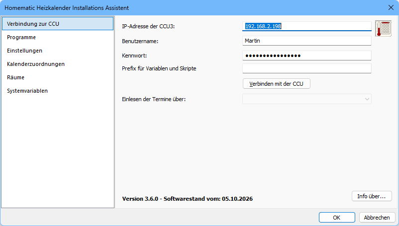

Über den Schalter **Info über...** können der genaue Softwarestand und die Lizenz der `HeizkalenderInstallation.exe` angezeigt werden. Außerdem lässt sich ein Browserfenster mit dem GitHub-Projekt öffnen, um gegebenenfalls eine neue Programmversion herunterzuladen.

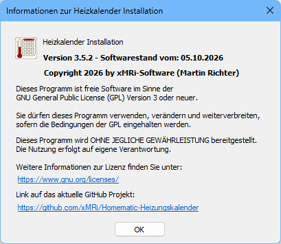

#### Verbinden mit der CCU

Im ersten Schritt muss eine Verbindung zur CCU aufgebaut werden, bevor weitere Einstellungen vorgenommen werden können.

1. Geben Sie die Ziel-IP der CCU an.
2. Geben Sie einen Benutzernamen an, der administrativen Zugriff auf die CCU hat.
3. Geben Sie das passende Kennwort an.
4. Geben Sie optional einen Prefix für Variablen und Skripte an (siehe Hinweis unten).
5. Klicken Sie auf den Schalter **Verbinden mit der CCU**.

> [!NOTE]
> Das Feld **Prefix** bleibt im Allgemeinen leer. Wird ein Prefix angegeben, erhalten alle Skripte, Programme und Variablen des Heizkalenders diesen Prefix im Namen vorangestellt.
>
> Damit lassen sich mehrere Installationen parallel testen oder eine Installation von bereits bestehenden Systemvariablen oder Programmen abgrenzen. Wird die bestehende Installation einer CCU ausgelesen, wird erwartet, dass alle bisher genutzten Variablen und Programme diesen Prefix verwenden.

> [!CAUTION]
> Wird der Prefix falsch verwendet, können Skripte und Variablen mehrfach installiert werden. Das kann zu Fehlfunktionen und zu einer Überlastung der CCU3 führen. Sollen mehrere Installationen parallel getestet werden, achten Sie darauf, dass immer nur ein Satz Programme aktiviert ist.
>
> **Nutzen Sie dieses Feld nur, wenn Sie sich über die Folgen im Klaren sind!**

#### Fehler beim Verbindungsaufbau

Ist keine Verbindung zur CCU möglich, weil die Verbindungsdaten (IP, Benutzername und Kennwort) nicht stimmen, erhalten Sie eine Fehlermeldung:

> [!NOTE]
> Konnte eine Verbindung hergestellt werden, werden die aktuellen Verbindungsinformationen in der Registry des aktuellen Benutzers gespeichert. Beim Neustart der `HeizkalenderInstallation.exe` sind die Felder **IP-Adresse**, **Benutzername**, **Kennwort** und **Prefix** dann bereits ausgefüllt.

### Einrichten einer neuen Installation

Ist bisher keine Installation auf der CCU vorhanden, erhalten Sie diese Meldung:

#### Auswahl der Ressourcen-/Terminquelle

Wählen Sie die gewünschte Quelle für Ihre Termine (ChurchTools, ChurchDesk, iCal, Google):

Beachten Sie, dass die Terminquelle auch nachträglich geändert werden kann. Die entsprechenden Skripte werden in diesem Fall geändert und überschrieben, und die Verbindungsdaten müssen angepasst werden.

Für jede Heizkalender-Variante sind unterschiedliche Informationen zum Auslesen/Aktualisieren der Ressourcen und Kalender notwendig. Diese werden nachfolgend beschrieben.

##### Verbindungsdaten angeben – ChurchDesk

Die benötigten Zugangsdaten für ChurchDesk sind bei den Varianten API und iCal identisch.

##### Verbindungsdaten angeben – ChurchTools

##### Verbindungsdaten angeben – iCal

##### Verbindungsdaten angeben – Google

### Nach dem Verbindungsaufbau mit der CCU

Bei einer bestehenden, eingerichteten CCU erhalten Sie eine Anzeige über den Verbindungsstatus und die Art der genutzten Ressourcen, wie in der folgenden Abbildung zu sehen ist.

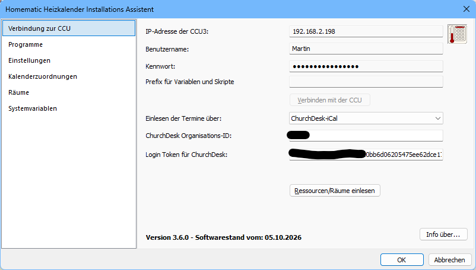

#### Wechsel zu einer anderen Ressourcen-Variante

<!-- TODO: Dokumentation oder Screenshot einfügen -->

### Eigenschaftsseite *Programme / Skripte*

Über diese Seite der `HeizkalenderInstallation.exe` werden alle installierten Programme angezeigt. Liegt für ein Programm ein Update vor, wird dies in der Informationsspalte angezeigt. Außerdem werden der aktuelle Programmstand und der Stand des Updates angezeigt, sofern vorhanden.

Die Programme mit den folgenden Namen sind reserviert und werden von der `HeizkalenderInstallation.exe` automatisch berücksichtigt. Sie müssen im Programmverzeichnis der `HeizkalenderInstallation.exe` liegen:

- `HK-Außentemperatur-Open-Meteo.hsc`
- `HK-Heizkurvenkontrolle.hsc`
- `HK-Skript 1.hsc`
- `HK-Skript 2.hsc`
- `HK-Systemprotokoll sichern.hsc`

Liegen im Installationsverzeichnis der `HeizkalenderInstallation.exe` auch Dateien mit dem Namen `Tool-*.hsc`, werden gleichnamige Programme in der CCU bei Bedarf ebenfalls aktualisiert. Das normale Installationspaket enthält keine Tools; diese befinden sich im separaten Ordner [Tools](../Tools).

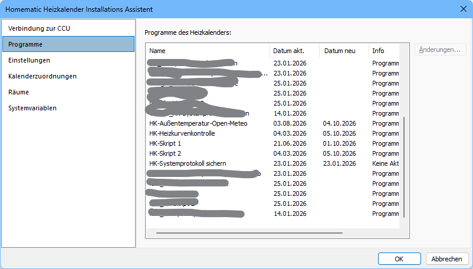

#### Änderungen in Skripten anzeigen

Ist das optionale Programm [WinMerge](https://winmerge.org) installiert, startet ein Klick auf den Schalter **Änderungen...** oder ein Doppelklick auf eines der Programme den Vergleich. Damit lassen sich die Änderungen zwischen altem und neuem Programmstand anzeigen und vergleichen.

### Eigenschaftsseite *Einstellungen*

Die Einstellungen auf dieser Seite beeinflussen das Grundverhalten des Heizkalenders.

#### Protokollierung im Systemprotokoll

Um die Funktionsweise des Heizkalenders transparent zu machen, wird das Systemprotokoll benutzt. Die Protokollierung kann dabei sehr granular aktiviert werden.

- **Allgemeine Protokollierung der Heizkalenderfunktionen** 
  Diese Funktion umfasst die Protokollierung allgemeiner Skripte, wie zum Beispiel die Außentemperaturermittlung. Über diese Option kann die Protokollierung ein- und ausgeschaltet werden.
   
  Dieser Wert wird in der Variable `HK-Logging` gespeichert.

- **Protokollierung für Skript 1** 
  Das `HK-Skript 1` dient dazu, die Termine aus den verschiedenen Terminquellen (ChurchDesk, ChurchTools, Google, iCal) einzulesen. Über diese Option kann die Protokollierung ein- und ausgeschaltet werden. 
  Dieser Wert wird in der Variable `HK1-Logging` gespeichert.

- **Protokollierung für Skript 2** 
  Das `HK-Skript 2` führt anhand der gelesenen Termine die eigentlichen Schaltvorgänge für die Heizungssteuerung durch. Über diese Option kann die Protokollierung ein- und ausgeschaltet werden.
   
  Dieser Wert wird in der Variable `HK2-Logging` gespeichert.

- **Protokollierung für die Heizkurvenkontrolle** 
  Das spezielle Skript `HK-Heizkurvenkontrolle` analysiert die aktuellen Heiztemperaturen. Mit den Einträgen dieses Protokolls lässt sich die Heizkurve optimieren oder grundsätzlich prüfen, ob die eingestellte Heizkurve funktioniert. 
  Dieser Wert wird in der Variable `HK-LoggingHeizkurvenkontrolle` gespeichert.

Beachten Sie, dass das Systemprotokoll nicht unendlich lang ist. Um das Heizverhalten über einen längeren Zeitraum beobachten zu können, sollten Sie einen USB-Stick einstecken und das Skript `HK-Systemprotokoll sichern` aktivieren. Dieses Skript speichert ältere Einträge des Systemprotokolls zyklisch auf dem USB-Stick. Ist kein USB-Stick eingesteckt, hat das Programm keine Wirkung.

#### Rückstellungsverhalten

- **Alle Räume Nachts um 01:00 Uhr auf Grundtemperatur zurückgestellt werden** 
  Ist diese Funktion aktiviert, kontrolliert `HK-Skript 2` nachts um 01:00 Uhr (genauer: täglich zwischen 00:57 und 01:03 Uhr), ob ein Heizkörper noch auf Heizen steht, also nicht auf die Grundtemperatur gestellt wurde. Das betrifft alle Räume ohne aktiven Termin. Ist dies der Fall, wird der Heizkörper bzw. die Heizgruppe auf die Raumgrundtemperatur zurückgesetzt. 
  Dieser Wert wird in der Variable `HK2-Hand-Grundtemp` gespeichert. 
  Details zur Nachtschaltung finden sich im [Anwenderhandbuch](../Dokumentation/Anwenderhandbuch.md).
   
  **Diese Option sollte immer eingeschaltet werden.**
- **Am Ende eines Termines eine manuell eingestellte/abweichende Temperatur für den Raum beibehalten** 
  Ist diese Option ausgeschaltet, wird nach Ablauf des Heizintervalls immer auf die Grundtemperatur des Raumes zurückgestellt. Ist die Option eingeschaltet und wird während eines Heizintervalls die Temperatur eines Raumes manuell am Thermostat geändert, bleibt diese Temperatur nach Ablauf der Heizphase erhalten, d. h. die Heizung wird nicht abgestellt. Spätestens bei eingeschalteter **Rückstellung auf Grundtemperatur** (s. o.) wird jedoch die Grundtemperatur wieder eingestellt. 
  Dieser Wert wird in der Variable `HK2-Hand-Temp` gespeichert. 
  **Diese Option sollte immer ausgeschaltet werden.**

#### Temperatureinstellungen

- **Grundtemperatur für alle Räume, wenn kein Heizvorgang läuft** 
  Die Grundtemperatur ist die Temperatur, die eingestellt wird, wenn für einen Raum keine Heizphase eingestellt wurde. Sie kann bei Bedarf in den Einstellungen eines Raumes individuell festgelegt werden. 
  Dieser Wert wird in der Variable `HK2-Grundtemperatur` gespeichert.

- **Außentemperaturgrenze, ab der kein Heizvorgang mehr ausgeführt werden soll** 
  Hier wird die Temperatur eingestellt, ab der grundsätzlich nicht mehr geheizt wird. Liegt die durchschnittliche Außentemperatur über diesem Wert, wird kein Heizvorgang mehr gestartet. 
  Dieser Wert wird in der Variable `HK2-A.Temp.Grenze` gespeichert.

##### Heizkurve / Vorheizzeiten bei entsprechenden Außentemperaturen

Bei der Heizkurve werden die Vorheizzeiten in Minuten zu den Außentemperaturen eingegeben.

Diese Werte sollten bei der Installation an das eigene Gebäude angepasst werden. Eine ausführliche Erklärung der Berechnung mit Beispielrechnungen findet sich im Artikel [Heizsteuerung-Vorheizzeit](Dokumentation/Heizsteuerung-Vorheizzeit.md).

Als Orientierungshilfe gibt es drei Beispielkurven:

| Kurventyp | −10 °C | −5 °C | 0 °C | 8 °C | 10 °C | 12 °C | 15 °C | 17,5 °C | Einsatz |
| :--- | ---: | ---: | ---: | ---: | ---: | ---: | ---: | ---: | :--- |
| Konservativ (Default) | 162 | 130 | 100 | 59 | 50 | 41 | 30 | 20 | Gut gedämmte Gebäude |
| Mittel | 220 | 180 | 144 | 95 | 85 | 75 | 61 | 50 | Typische Gemeindegebäude |
| Großzügig | 451 | 370 | 297 | 196 | 174 | 154 | 125 | 103 | Träge Heizsysteme / Fußbodenheizung |

**Diese Werte sollten für jedes Gebäude mithilfe des Skripts `HK-Heizkurvenkontrolle` angepasst werden.**

Diese Werte werden in der Variable `HK2-Kurve` gespeichert.

### Eigenschaftsseite *Kalenderzuordnung*

Über die **Kalenderzuordnung** werden einem Kalender (einer Ressource bzw. einem Raum aus ChurchDesk/ChurchTools) ein oder mehrere Räume zugeordnet. Die vorhandenen Kalender werden von der `HeizkalenderInstallation.exe` bei manchen Verbindungen automatisch ermittelt.

In dieser Übersicht werden die Ressourcen-IDs und die Namen der entsprechenden Kalender/Räume angezeigt.

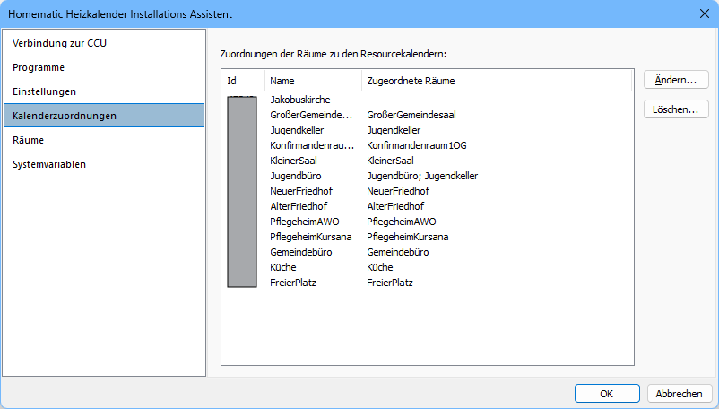

Wird eine Ressource eingelesen, für die keine zu steuernden Thermostate oder Aktoren existieren (weil sie zum Beispiel einen Beamer oder ein Fahrzeug darstellt), kann sie über den Schalter **Löschen...** entfernt werden. Das sorgt für mehr Übersicht im Heizkalender. Beim Löschen eines Kalendereintrags gehen allerdings alle zugeordneten Räume verloren. Eine gelöschte Ressource wird erneut angelegt, wenn die Funktion **Ressourcen / Räume einlesen** ausgelöst wird.

Mit einem Doppelklick auf den Kalendereintrag oder über die Funktion **Ändern...** öffnet sich ein Dialog, in dem diesem Kalender ein oder mehrere Räume aus dem Heizkalender zugeordnet werden können.

Diese Werte werden in der Variable `HK1-R-Liste` gespeichert.

#### Raumzuordnung zu den Ressourcen/Kalendern

Über diesen Dialog können Sie einem Kalender (Raum/Ressource) einen oder mehrere Räume zuordnen.

Die Zuordnung mehrerer Räume ist sinnvoll, wenn zum Beispiel bei der Nutzung eines Saales grundsätzlich auch Foyer und WCs beheizt werden sollen. Sonst müssten auch Foyer und WCs als eigene Ressourcen verwaltet und gebucht werden, was oft nicht praktikabel ist. Räume können beliebig oft beliebigen Kalendereinträgen zugeordnet werden. So lassen sich zum Beispiel WCs und Foyer immer beheizen, wenn ein bestimmter anderer Raum gebucht wurde.

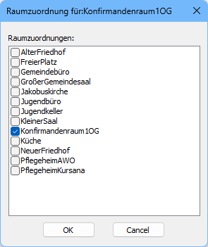

Wird einem Kalendereintrag kein Raum zugeordnet, erfolgt auch keine Schaltung für diesen Kalender.

Diese Zuordnung wird in der Variable `HK2-HKG-Liste` gespeichert.

### Eigenschaftsseite *Räume*

Auf der Eigenschaftsseite *Räume* werden die aktuellen Räume angezeigt, die im Heizkalender benutzt werden. Alle hier aufgeführten Räume können einem oder mehreren Kalendereinträgen/Ressourcen zugeordnet werden (siehe Eigenschaftsseite *Kalenderzuordnung*).

Über die Funktion **Löschen...** kann ein Raum aus dem Heizkalender entfernt werden. Alle Raumzuordnungen und Einstellungen des Raumes werden dabei aus dem System entfernt.

Über die Funktion **Neu...** kann ein neuer Raum angelegt werden. Bei der ersten Verbindung zu ChurchDesk/ChurchTools legt die `HeizkalenderInstallation.exe` für jede Kalenderressource eine Raumvariable an. Räume wie die genannten Beispiele Foyer/WCs müssen manuell angelegt werden.

Über die Funktion **Ändern...** oder einen Doppelklick auf den Raum können die Einstellungen eines Raumes geändert werden.

Für jeden Raum wird eine eigene Raumvariable `HKG-Raum-<Name>` angelegt, die die entsprechenden Einstellungen enthält. Wird ein Raum gelöscht, wird auch die Variable entfernt.

#### Eigenschaften von Räumen

In diesem Dialog legen Sie die individuellen Eigenschaften eines Raumes sowie die Zuordnung der Aktoren, Thermostate bzw. Heizgruppen fest.

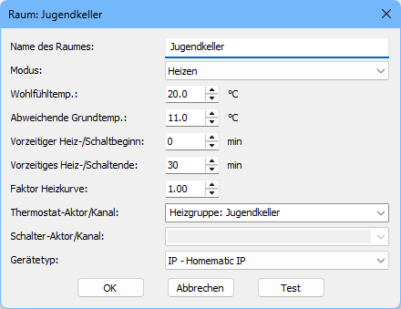

- **Name** 
  Das Feld Name bestimmt, welche Variable `HKG-Raum-<Name>` zum Speichern der Informationen verwendet wird. Der Name wird außerdem intern in der `HeizkalenderInstallation.exe` bei der *Kalenderzuordnung* verwendet.

- **Modus** 
  Es gibt drei verschiedene Modi zum Ansteuern der Thermostate oder Aktoren eines Raumes. Weitere Informationen finden Sie im Abschnitt *Modus*. Üblicherweise wird *Heizen* zur Steuerung von Thermostaten und *Schalten* zur Steuerung von Aktoren (zum Beispiel einer Außenbeleuchtung oder Lüftungsanlage) benutzt. Der Modus *Heizen+Schalten* ist ein spezieller Modus, mit dem eine Heizungsanlage mit eigener Temperatursteuerung geregelt werden kann.

- **Wohlfühltemperatur** 
  Diese Temperatur ist die Zieltemperatur, die bei einem Termin für diesen Raum erreicht werden soll. Da jeder Raum seine eigene Zieltemperatur hat, kann zum Beispiel ein Gruppenraum auf 20 °C und ein WC auf 18 °C vorbelegt werden. 
  Im Modus *Schalten* wird dieser Wert nicht verwendet.

- **Abweichende Grundtemperatur** 
  Dies ist die Temperatur, die für diesen Raum außerhalb der Heizzeiten eingestellt sein soll. Der Wert ist mit dem Wert aus den Einstellungen vorbelegt und lässt sich für jeden Raum individuell ändern. So kann zum Beispiel ein Raum weniger stark abgesenkt werden, als es in einer Installation normalerweise üblich ist.

- **Vorzeitiger Heiz-/Schaltbeginn** 
  Mit diesem Wert kann der Heiz-/Schaltbeginn grundsätzlich vorverlegt werden, zusätzlich zu der Zeit, die sich aus Außentemperatur, Heizkurve und Temperaturdifferenz zur Zieltemperatur ergibt. 
  Im Modus *Schalten* wird keine Vorheizzeit berechnet. Der Wert kann aber trotzdem genutzt werden, um zum Beispiel eine Außenbeleuchtung 30 min früher einzuschalten. 
  Ein positiver Wert verschiebt den Einschaltpunkt nach vorne, ein negativer Wert verschiebt ihn zeitlich nach hinten.

- **Vorzeitiges Heiz-/Schaltende** 
  Mit diesem Wert kann das Heiz-/Schaltende grundsätzlich vorverlegt werden. 
  Es kann sinnvoll sein, das Heizen eines Raumes bereits 30 min vor dem Ende des Termins zu beenden oder die Außenbeleuchtung 30 min über das Ende eines Termins hinaus eingeschaltet zu lassen. 
  Ein positiver Wert verschiebt den Ausschaltpunkt nach vorne, ein negativer Wert verschiebt ihn zeitlich nach hinten.

- **Faktor Heizkurve** 
  Im Modus *Heizen* wird aus der eingestellten Heizkurve, der Außentemperatur und der aktuellen Raumtemperatur eine Vorheizzeit berechnet. Für Räume mit vielen Außenwänden oder einem trägen Heizsystem (Fußbodenheizung) kann es nützlich sein, die Vorheizzeit mit einem Faktor zu vergrößern. Für eine Fußbodenheizung kann der Faktor 3,5 eine gute Voreinstellung sein. Bei innen liegenden Räumen lässt sich die Vorheizzeit zum Beispiel mit dem Faktor 0,5 halbieren. 
  Im Modus *Schalten* wird dieser Wert nicht verwendet. 
  Erlaubt sind Werte zwischen 0,2 und 5. Das entspricht minimal 20 % und maximal dem Fünffachen der errechneten Vorheizzeit.

##### Modus

Der Modus legt fest, wie die Thermostate oder Aktoren des Raumes angesteuert werden.

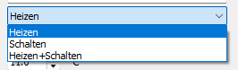

<!-- TODO: Die Modi Heizen, Schalten und Heizen+Schalten ausführlicher beschreiben -->

##### Gerätetyp

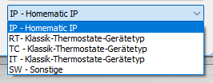

<!-- TODO: Beschreibung der Gerätetypen ergänzen -->

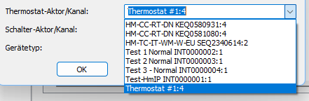

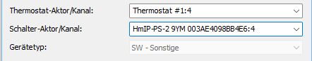

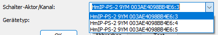

### Eigenschaftsseite *Systemvariablen*

Auf der Eigenschaftsseite *Systemvariablen* werden alle aktuellen Systemvariablen angezeigt. In den Einstellungen verwendet die `HeizkalenderInstallation.exe` immer nur die reinen Raumnamen; intern in den Skripten werden Prefixe verwendet. So wird für jeden Raum der Prefix *HKG-Raum-* benutzt. Die Systemvariablen für die Räume müssen daher mit dem entsprechenden Prefix gesucht werden.

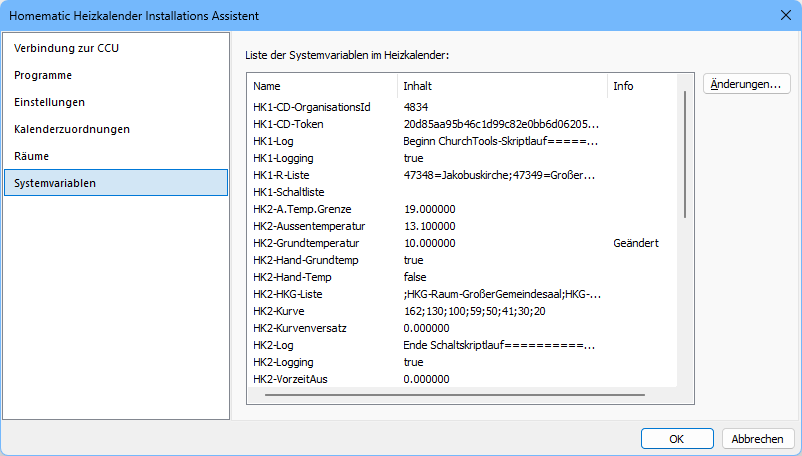

Es werden alle Systemvariablen mit ihrem Inhalt angezeigt, außerdem der Status, ob die Variable verändert wurde. Alle Änderungen in den Einstellungen, den Raumparametern und den Kalenderzuordnungen führen letztlich dazu, dass Systemvariablen angepasst werden. Änderungen an den Raumeinstellungen lassen sich daher sofort in den Änderungen der entsprechenden Systemvariablen nachverfolgen.

Durch einen Doppelklick auf eine Systemvariable oder auf den Schalter **Änderungen...** können Sie die Änderungen kontrollieren, die durch das Speichern der Daten durchgeführt werden.

#### Änderungsinformationen zu einer Systemvariablen

Dieser Dialog zeigt den aktuellen Status einer Systemvariablen: die interne ID, den Typ und den Namen sowie den alten und den neuen Inhalt. Außerdem werden der Status (Geändert/Unverändert) und die Angabe angezeigt, ob die Variable im Systemprotokoll protokolliert wird.

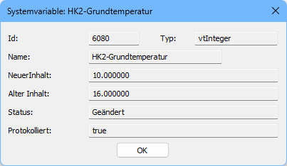

## Speichern der Einstellungen

Die Einstellungen werden gespeichert, indem Sie im Hauptdialog auf den Schalter **OK** klicken.

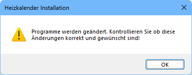

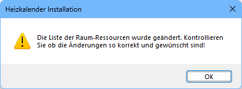

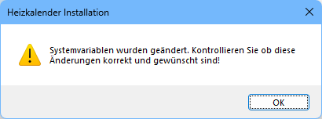

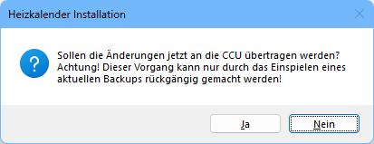

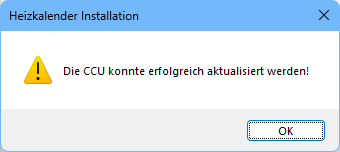

Um weitere Änderungen vorzunehmen, starten Sie die `HeizkalenderInstallation.exe` erneut.

### Abbrechen der Installation

<!-- TODO: Text ergänzen (der Satz "Wenn Sie" war im Original unvollständig) -->

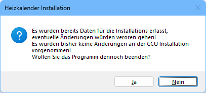