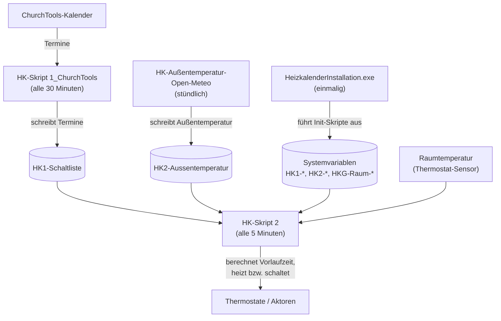

# HomeMatic-Heizungskalender

Der HomeMatic-Heizungskalender dient zur Steuerung der Homematic über ChurchTool, ChurchDesk, iCal oder Google.
Er umfasst Skripte, Tools und eine Installations- und Update-Software. Die Skripte werden intern über Systemvariablen gesteuert.

## Allgemeines

Der Heizkalender ist eine Idee von Helmut W. Diedrichs und wurde erstmals 2019 in der
Stadtmission Arheilgen angewendet. Lukas Helduser entwickelte 2023 auf der Basis der Homematic
das Heizkalender-Programm für die Allgemeinheit, inkl. Varianten.
Dank an die seitherigen Anwender für ihre Verbesserungsvorschläge, insbesondere an die Pilot-
Gemeinden. Dieser Code wurde im Rahmen der Heizkalender-Implementierung der Baptisten Gemeinde
Hanau von Martin Richter stark optimiert und erweitert.

Das Heizkalender-Team freut sich, dass Sie den kostenlosen Heizkalender anwenden und somit einen
Beitrag zum Umweltschutz leisten. Es wäre schön, wenn Sie die Nutzung per E-Mail anzeigen an: <info@heizkalender.de>

Weitere Informationen, Varianten (neben Homematic auch Home Assistant und FRITZ!Box),
Anleitungen und ein Blog finden sich auf der Projekt-Homepage <https://heizkalender.de/>.

Dadurch ergäbe sich eine Übersicht und die Möglichkeit auf Änderungen hinzuweisen. Bitte
berichten auch Sie über Ihre Erfahrung mit dem Heizkalender.

## Dokumentation

### Für Anwender

- [Planung](/Dokumentation/Planung.md): Struktur planen, Nomenklatur für Aktoren- und Heizgruppen (vor der Installation).
- [Kalender-Zugangsdaten ermitteln](/Dokumentation/Kalender-einrichten.md): Token/IDs für ChurchTools, ChurchDesk usw. beschaffen.
- [Anwenderhandbuch](/Dokumentation/Anwenderhandbuch.md): Sonderbefehle, Raumvariablen, Vorheizzeit im laufenden Betrieb.
- [Installer-Anleitung](/HeizkalenderInstallation/Dokumentation/Readme.md): Einrichtung und Updates auf der CCU.
- [Skript-Referenz](/Skripte/Dokumentation/Readme.md): alle Skripte und Systemvariablen im Detail.
- [Heizsteuerung und Vorheizzeit](/Skripte/Dokumentation/Heizsteuerung-Vorheizzeit.md): Berechnung der Vorheizzeit mit Beispielen.
- [Tools](/Tools/Readme.md): optionale Zusatz-Skripte für Diagnose, Logging und Wartung.

### Für Entwickler

- [Entwickler-Dokumentation](/Dokumentation/Entwickler.md): Skript-Syntax, Installer-Build, Versionierung, Beitrag-Workflow.
- [CHANGELOG](/CHANGELOG.md): zentrale Änderungshistorie (Datums-Stände).

### Archiv (historische Dokumente)

- [Neue Funktionen 2026](/Dokumentation/Archiv/Neue-Funktionen-2026.md): historisches Release-Begleitdokument.
- [Handbuch-ENTWURF01-20260110.pdf](/Dokumentation/Archiv/Handbuch-ENTWURF01-20260110.pdf): früher Handbuch-Entwurf (PDF).
- [HK-Anleitung V3.1.1.pdf](/Backup-Originale/3.2.1/HK-Anleitung%20V3.1.1.pdf): ältere Anleitung (PDF, im Ordner der Original-Skripte).

## Ordner-Konvention

| Ordner | Inhalt |
| :--- | :--- |
| `Skripte/` | Release-Ordner: die `.hsc`-Kern-Skripte (Skript-1-Varianten, Skript 2, Init-Skripte, HK-Test-Skript, Heizkurvenkontrolle, Außentemperatur, Protokoll-Sicherung), eine lauffähige Kopie der `HeizkalenderInstallation.exe` sowie die mitgelieferte Skript-Referenz. So ist ein GitHub-Release direkt nutzbar. |
| `Tools/` | Optionale Zusatzwerkzeuge (Diagnose, Logging, Wartung). |
| `Tests/` | Entwickler-Testfälle, nicht für den Produktivbetrieb. |
| `HeizkalenderInstallation/` | Windows-Installer-Quellcode (C++/MFC) und dessen Doku. Die gebaute `.exe` liegt als Kopie in `Skripte/`. |
| `Dokumentation/` | Übergreifende Anwender-, Entwickler- und Archiv-Doku. |
| `Backup-Originale/` | Historische Original-Skripte, nur zur Referenz. |

Das `HK-Test-Skript.hsc` liegt bewusst unter `Skripte/`, wird aber vom Installer
**nicht** installiert (es steht nicht auf dessen fest einkompilierter Skript-Liste).
Es ist nur zum manuellen Ausführen per „Skript testen" auf der CCU gedacht und
gibt die aktuelle Konfiguration zu Diagnose-/Support-Zwecken aus.

## Skripte

Die Skripte sind das Kernstück des Heizkalenders. Sie umfassen 3 Gruppen.

1. **Skript 1:** Einlesen von Terminen aus unterschiedlichen Quellen (Google, iCal, ChurchDesk iCal/API und ChurchTools). Pro Quelle gibt es eine eigene Variante (`HK-Skript 1_ChurchTools`, `HK-Skript 1_Google` usw.); es wird immer nur eine eingesetzt. Die eingelesenen Termine landen in der Systemvariablen `HK1-Schaltliste`.
2. **Skript 2:** Schalten der Thermostate (`HK-Skript 2`) sowie Hilfsmittel zur Überwachung. Es liest `HK1-Schaltliste` und schaltet die Heizung entsprechend.
3. Diverse andere optionale Hilfsmittel.

Die Systemvariablen folgen diesem Namensschema: `HK1-` für Skript 1 (Termineinlesen), `HK2-` für Skript 2 (Schalten) und `HKG-Raum-*` für die einzelnen Räume.

Intern gesteuert werden die Skripte durch Systemvariablen, die das Verhalten der Skripte kontrollieren. Die Skripte selbst sind auf allen Installationen austauschbar.

### Zusammenspiel der Komponenten (Beispiel ChurchTools)

Der Installer legt mit den Init-Skripten einmalig die Systemvariablen an. Danach
laufen die Skripte unabhängig voneinander in ihren eigenen Intervallen und
kommunizieren ausschließlich über Systemvariablen.

Ablauf im Detail:

1. **Einmalig:** Der Installer schreibt über die Init-Skripte die Systemvariablen.
2. **Stündlich:** `HK-Außentemperatur-Open-Meteo` aktualisiert die Außentemperatur in `HK2-Aussentemperatur`.
3. **Alle 30 Minuten:** `HK-Skript 1_ChurchTools` liest die ChurchTools-Termine und schreibt sie in `HK1-Schaltliste`.
4. **Alle 5 Minuten:** `HK-Skript 2` berechnet aus der Schaltliste, der Außentemperatur und der aktuellen Raumtemperatur die Vorlaufzeiten und heizt bzw. schaltet die Räume entsprechend.

Die Hauptskripte und eine ausführbare Version der HeizkalenderInstallation findet sich [hier](/Skripte).
Eine Zusammenfassung der Skripte und eine Beschreibung ist [hier](/Skripte/Readme.md) zu finden.
Die Tools und weitere Beispielskripte finden sich [hier](/Tools).
Eine Zusammenfassung der Tools und eine Beschreibung ist [hier](/Tools/Readme.md) zu finden.

## Heizkalender-Installation

Der Heizkalender-Installer ist ein Tool zur Einrichtung und Updates der Heizkalender Software auf einer CCU.
Der Installer ermöglicht die Neuinstallation oder auch Updates bestehender Installationen. Er bietet eine benutzerfreundliche Oberfläche zur Konfiguration der Heizkalender und unterstützt die Generierung von Skripten und notwendigen Systemvariablen, die in der HomeMatic CCU oder ähnlichen Systemen verwendet werden können.

[Weitere Informationen und eine Anleitung finden sich hier.](/HeizkalenderInstallation/Dokumentation/Readme.md)

## Systemvoraussetzungen für die Heizkalender-Installation

- Betriebssystem: Windows 10 oder höher
- Die CCU muss in den Sicherheitseinstellungen den Zugriff auf die Remote Homematic-Script API erlauben. Hier muss entweder ein eingeschränkter Zugriff auf die benötigten Funktionen oder ein vollständiger Zugriff gewährt werden, damit der Installer die notwendigen Skripte und Variablen erstellen kann.
- Ein Administrator-Benutzer und das entsprechende Kennwort müssen bekannt sein.
- Alle Skripte, die installiert werden sollen, müssen im Programmverzeichnis des Heizkalender-Installers liegen. Die Namen sind vorgegeben und dürfen nicht verändert werden. Es können aber weitere Tool-Skripte hinzugefügt werden, die dann ebenfalls aktualisiert werden.
- Um auf Ressourcen und externe Kalender zugreifen zu können, muss der Rechner mit dem Internet verbunden sein.
- Eine lauffähige Kopie des Installers liegt im Skripte-Verzeichnis.

## Lizenz

Der Heizkalender-Installer ist freie Software.

- Copyright (C) 2026 by Martin Richter (xMRi-Software)

- Weitere Teile Copyright (C) 2026 by Team Heizkalender:
Lukas Helduser, Martin Richter (xMRi-Software), Helmut Diedrichs

Im Detail ist dies in den Köpfen der Skripte und Sourcecodes zu lesen.

Dieses Programm wird unter den Bedingungen der
**GNU General Public License Version 3 (GPLv3)**
oder – nach Ihrer Wahl – jeder späteren Version veröffentlicht.

Sie dürfen das Programm verwenden, verändern und weiterverbreiten,
sofern alle abgeleiteten Werke ebenfalls unter der GPL lizenziert
werden und der Quellcode verfügbar bleibt.

Dieses Programm wird OHNE JEGLICHE GEWÄHRLEISTUNG bereitgestellt,
auch ohne die implizite Gewährleistung der Marktfähigkeit oder
Eignung für einen bestimmten Zweck.

Der vollständige Text der Lizenz ist in der Datei [`LICENSE`](/LICENSE) enthalten oder unter folgender Adresse abrufbar:
<https://www.gnu.org/licenses/>

## Hinweis zur Nutzung mit Homematic / CCU / IoT-Systemen

Diese Software wurde für die unterstützende Konfiguration und
Verwaltung von zeitbasierten Heizungssteuerungen entwickelt,
insbesondere im Umfeld von Homematic-, CCU- und vergleichbaren
IoT-Systemen.

Der Heizkalender-Installer steht in keiner Verbindung zur
eQ-3 AG oder anderen Herstellern von Smart-Home-Komponenten.

Die Software:

- ersetzt keine sicherheitsrelevanten Schutzmechanismen
- greift nicht eigenständig in Regelungs- oder Notfallfunktionen ein
- übernimmt keine Überwachung von Temperatur-, Frost- oder
  Sicherheitsgrenzwerten

Skripte, Programme oder Konfigurationen, die durch diese Software
erstellt oder verändert werden, sollten vor dem Einsatz in
produktiven Systemen sorgfältig geprüft werden.

Der Autor übernimmt keine Haftung für Schäden an:

- Homematic-Zentralen (CCU, RaspberryMatic, debmatic)
- Aktoren, Sensoren oder Heizungsanlagen
- angebundenen IoT- oder Smart-Home-Systemen

Die Nutzung erfolgt ausschließlich auf eigene Verantwortung.
Vor jeder Änderung wird dringend empfohlen, ein vollständiges
Backup der CCU-Konfiguration anzufertigen.
